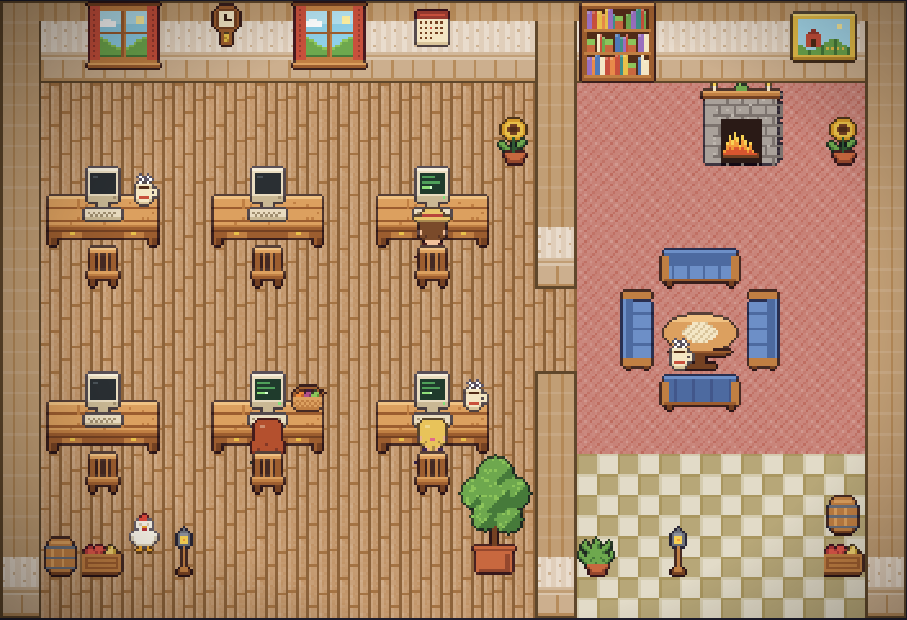
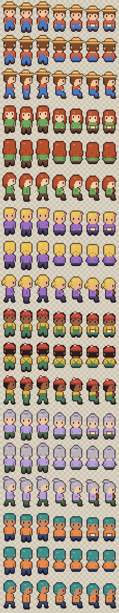
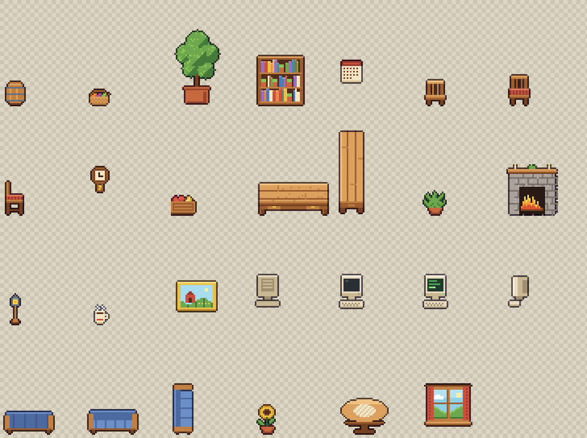

# asaoffice — a Stardew-style pixel office for Claude Code

> 🇮🇩 **Pemula?** Baca [PANDUAN.md](PANDUAN.md): panduan langkah demi langkah dalam bahasa Indonesia.

A cozy farmhouse reskin of [`pixel-agents`](https://github.com/pixel-agents-hq/pixel-agents): every Claude Code
session turns into a little villager who walks to a wooden desk, types on a retro computer while the agent edits
files, reads while it searches, and pops a bubble when it's waiting on you. It runs locally and you can watch it
from your phone through a tunnel.



The pack is **original pixel art**, drawn by `tools/` in a Stardew Valley–*inspired* style (warm wood, gingham,
sunflowers, an orange office cat and a hen). No sprites are taken from Stardew Valley or any other game.

| Thirteen villagers (walk · type · read, 3 directions each) | Furniture |
| --- | --- |
|  |  |

## What's in here

| Path | What it is |
| --- | --- |
| `stardew-pack/` | External asset directory for **Settings → Add Asset Directory**: villagers 7–13 (Wren, Pip, Sari, Gus, Iris, Bayu, and Shades the director), 24 furniture items (desk, chair, retro PC with on/off animation, sofa, fireplace, window, bookshelf, plants, the director's desk and chair…), and two pets: Oyen the cat (the layout's default) and Clucky the hen. |
| `overlay/` | Stardew floors (9 textures), wallpaper/wainscot walls, and villagers 1–6 (Asa, Rowan, Clem, Theo, Mabel, Juno) in place of the bundled characters, for the parts `pixel-agents` only loads from its own bundle. |
| `addon/` | Browser add-ons for the office: [idle chat](#idle-chat), [idle activities and expressions](#idle-activities-and-expressions), a [villager card, clickable calendar and Holo-board](#villager-card-calendar-and-holo-board), a [camera lock, notifications, task board and day & night](#camera-lock-notifications-task-board-and-day--night), and a [Pomodoro timer](#pomodoro) on the wall clock. |
| `staff/` | The [office staff](#office-staff) (also the [mailbox](#mailbox-send-tasks-from-the-office)'s task runners): six Claude Code subagents with job descriptions (`staff/agents/*.md`), each played by a villager (`staff/roster.json`). Install with `npm run staff`. |
| `layouts/stardew-office.json` | A ready-made 33×24 landscape office with a garden around it. Top band: an **open-plan work area** with six desks in three divisions that share one room and are told apart only by floor tint and furniture (no walls), a **meeting room** (one long table, only for meetings, with the quest board, task board, mailbox and calendar on its wall) and the **director's room** (Shades' desk (he faces into the room), a private corner and a big window). Bottom band: a compact toilet and pantry, the breakout corner (green sofas round the tea table, whiteboard) with the front door, and a guest lounge with the fireplace. Outside: a stone path, vegetable beds, a well, a pond, trees and a fence. Windows are only on the outer walls. Import it via **Layout → Import**, or `npm run layout`. |
| `tools/` | The sprite generator (`npm run generate`), plus setup, launcher, and tunnel scripts. |

## Quick start

You need Node.js 20+ and the Claude Code CLI, on the machine where you run Claude.

```bash
git clone <this repo> ~/asaoffice
cd ~/asaoffice
npm install
npm run setup      # register the pack, apply the overlay, install the layout (run with the office stopped)
```

`npm run setup` runs three steps you can also run on their own:

- `npm run register` adds `stardew-pack/` to `~/.pixel-agents/config.json`. That's the same as **Settings → Add Asset Directory**.
- `npm run overlay` copies `overlay/` into this repo's installed copy of `pixel-agents`, installs the idle-chat addon, and backs up the originals. Undo it with `npm run overlay:restore`.
- `npm run layout` backs up `~/.pixel-agents/layout.json`, then installs the Stardew layout.

Optionally, `npm run staff` hires the [office staff](#office-staff): six Claude Code subagents with their own jobs.

### Phase 1: run it and watch a real session

```bash
cd ~/code/my-project                 # the workspace whose Claude sessions you want to see
npm --prefix ~/asaoffice run office  # starts pixel-agents on http://127.0.0.1:3100
```

1. Open the printed `http://127.0.0.1:3100/?token=…` URL. The token is a secret, so don't share it.
2. When the onboarding asks, approve **Install Hooks** (or later, turn on **Settings → Instant Detection (Hooks)**).
3. In another terminal, from the same folder, start `claude`. A villager spawns. It sits and types while Claude edits
   files, reads while it searches, and shows a bubble when it needs permission.
4. If no villager appears, check that hooks are on. If the session was started in another folder, turn on
   **Settings → Watch All Sessions**.

**Claude Code in the Claude Desktop app** works too, as long as the session runs locally on your Mac (not in cloud
or remote mode). Desktop sessions often run in a different folder, or in a worktree the app creates, so turn on
**Settings → Watch All Sessions** in the office. Then give the session a task that reads or edits files. Plain Claude chats
and cloud sessions can't show up, because they don't run Claude Code on your machine.

`npm run office` always uses the `pixel-agents` installed in this repo, pinned to 1.4.1 so the overlay applies.
A bare `npx pixel-agents` would run a separate copy without the Stardew floors, walls, and base characters.
You can pass extra flags through, for example `npm --prefix ~/asaoffice run office -- --no-terminal`.
Set `OFFICE_PORT` to use a port other than 3100.

### Open it without Terminal (macOS)

```bash
npm run app        # builds ~/Applications/Asa Office.app (re-run after moving the repo or upgrading Node)
```

Open **Asa Office** from Spotlight or Finder, then right-click its Dock icon → **Options → Keep in Dock**. Clicking
it starts the office in the background if it isn't running (log: `~/Library/Logs/asaoffice/office.log`) and opens
it with the current token in its own window: an app-mode window of Chrome, Edge, or Brave if one is installed,
otherwise your default browser. Click the Dock icon again to reopen the window. Quit the app (⌘Q) to stop the
office it started; an office you started from Terminal is left alone. The first time, macOS asks whether
**Asa Office** may access your calendars. `npm run app -- --remove` deletes the app.

### Phase 2: the reskin

**Settings → Add Asset Directory** only covers characters, pets, and furniture. Floors, walls, and the six base
characters come from `pixel-agents`' own bundle, so the external directory alone gives you Stardew furniture on the
default grey floors, and a mix of old and new characters. The overlay fills that gap without touching
`pixel-agents`' source: it swaps PNGs inside `node_modules/pixel-agents/dist`. Re-run `npm run overlay` after every
`npm install`.

- **Only the pure external-directory route:** skip `npm run overlay`. Everything still works, and the Stardew
  furniture shows up in the Layout palette.
- **Colours:** floors and walls are grayscale textures. The layout tints them (warm boards, a rose rug, a cream
  checkerboard, beige wallpaper). You can re-tint any tile with the Layout editor's colour controls.
- **Editing the art:** change `tools/lib/*.mjs` and run `npm run generate` (the output is deterministic). You can
  also open the PNGs in Aseprite, or use `pixel-agents`' `scripts/asset-manager.html` for manifests.

### Phase 3: watch from your phone

The server stays on `127.0.0.1`. `npm run office` refuses `--host`. A tunnel carries it to your phone instead.
Vercel can't host this, because the office is a live Node server with a persistent WebSocket, not a static site.

```bash
# with the office running, in another terminal:
npm --prefix ~/asaoffice run tunnel            # uses cloudflared if installed, otherwise ngrok
npm --prefix ~/asaoffice run tunnel -- --ngrok # force ngrok (e.g. a fixed ngrok domain you've configured)
```

The script reads the running server's token from `~/.pixel-agents/servers/`. It prints
`https://<random>.trycloudflare.com/?token=…` and a QR code: scan the QR with your phone and bookmark the page.

- Install [cloudflared](https://developers.cloudflare.com/cloudflare-one/connections/connect-networks/downloads/)
  (a quick tunnel needs no account) or [ngrok](https://ngrok.com/download).
- **The tunnel URL is as sensitive as the local one.** Anyone holding it can approve hook installs. Keep it out of
  shared chats. It also ends up in browser history and the server's request log.
- The URL changes every time the tunnel restarts, unless you use a reserved ngrok domain. Restart the tunnel
  whenever you restart the office.
- If you run your own tunnel command, **don't rewrite the Host header** (no `--http-host-header` or
  `--host-header=rewrite`). `pixel-agents` only accepts WebSocket connections whose `Origin` matches `Host`.

## Idle chat

When a session is idle, its villager doesn't only sit at the desk or wander alone. Every few seconds, two
villagers that have been idle for 10 seconds or more may walk to a free spot, face each other, and chat in pixel
speech bubbles. If either one gets a task, it breaks off mid-sentence ("Waduh, ada tugas. Duluan ya!") and
`pixel-agents` walks it back to its desk as usual. Each villager then waits 45–120 seconds before chatting again,
and no chats happen while the Layout editor is open.

The lines are scripted, so they cost no tokens and work the same through the tunnel. They pick up real context
from each session: the last tool it used (edits, searches, Bash, web, sub-agents, to-dos), its project folder
(including whether both work on the same one), how full its context window is, and the time of day and weekday.

- **Language:** Indonesian by default. Add `&chatLang=en` to the office URL for English (it's remembered).
- **Turn it off:** add `&idleChat=off` to the URL (remembered; `&idleChat=on` turns it back on). To install
  the art overlay without any add-ons: `node tools/apply-overlay.mjs --no-addon`.
- **Edit the dialogue:** change `addon/idle-chat-lines.js`, run `npm run overlay`, and reload the page.
  Timing and frequency are in `CFG` at the top of `addon/idle-chat.js`.
- **Console:** `__asaoffice.idleChat.start()` starts a chat right away between any two idle villagers, and
  `__asaoffice.idleChat.conversations` lists the chats in progress.

## Idle activities and expressions

- **Idle activities:** besides chatting, a villager that has been idle for a while may take a coffee break by a barrel
  or crate, sit and read on a free sofa seat, browse the bookshelf, warm up at the fireplace (more often in the
  evening), look out of a window, water a plant, or pet the office pet. A small speech bubble says what it's doing and the villager
  card says what it's doing. If its session gets a task, it drops everything (and gets up from the sofa) and
  pixel-agents walks it back to its desk. Sofa seats assigned to an agent are never used, and a villager is never in
  a chat and an activity at once. `&idleActivities=off` turns them off; `__asaoffice.activities.start('sofa')` starts
  one right away.
- **The canteen, the toilet and the garden** (bigger layout): idle villagers also **eat** at the canteen tables (they
  sit on a free chair), grab a snack from the vending machine, get water from the dispenser or the fridge, and use the
  **toilet**: they walk into a stall, a **closed door with an "occupied" plate** covers them for 8–14 seconds, and
  mostly they wash their hands afterwards. By day they also check the vegetable beds, watch the pond, draw water at the
  well and sit by the bench. In the open-plan office they sketch on the whiteboard easel and use the copier. **Around noon (11:45–13:15) nearly every idle villager goes to eat**, and there is a coffee
  and snack round at 15:00. Kinds the layout doesn't have are simply skipped, so older layouts still work.
- **The garden** (`addon/garden.js`): the vegetable beds grow with your **day streak**: plant 1 is sown on day 1, and
  each plant sprouts, grows and ripens over the following days (carrots, tomatoes, cabbages, 12 plants); a broken streak
  clears the beds. The garden also follows the **season** of the real date (`&season=spring|summer|fall|winter` to
  force one): a soft tint plus drifting petals, autumn leaves or snow. `&garden=off` turns it off.
- **Expressions:** a floating "zzz" when a session's context window is 80% full or more (time for `/compact`), a sweat
  drop after 15 minutes of non-stop work or when a permission request has waited over a minute, and a happy hop with
  sparkles when a turn it worked on for 8+ seconds finishes. `&expressions=off` turns them off;
  `__asaoffice.expressions.preview(id, 'zzz' | 'sweat' | 'hop')` tries one on a villager.

## Villager card, calendar, and Holo-board

- **Villager card:** click a villager. Next to the usual camera follow, a card shows its name, what it's doing
  (working with which tool, needs permission, waiting for you, chatting with whom, or relaxing), its project,
  last tool, context-window fill, sub-agents, and when it appeared. Click the villager again, or ×, to close it.
  **Renaming:** the ✏️ next to the name changes it (up to 20 characters; empty puts the original back; Enter saves, Esc cancels).
  An ordinary villager is renamed by its face (so the name stays when sessions come and go), a staff member by its agent;
  Shades and helper sub-agents can't be renamed. Names are kept on the Mac in `~/.pixel-agents/asaoffice-names.json` (the data
  feed carries them, so the laptop and the phone show the same ones) and show up on the HUD cards, bubbles, journal and
  mailbox (`@mention`, letters); tasks are told the staff's new names so plans and reports use them too. The staff roster file
  and the Claude Code agent names are not touched.
- **Calendar:** click the wall calendar for a month view (Monday first, with the Stardew season) of your macOS
  Calendar events, from last month to two months ahead. Click a day for its agenda. A red badge on the calendar
  shows how many events are on today.
- **Bookshelf (Rak Buku), your notes in Obsidian:** open it with the 📚 button on the hero card (or click any bookshelf).
  The notes are plain Markdown files in an Obsidian vault at `~/AsaOffice-Vault` (created on first use with
  `Ide-TODO.md`, `Laporan/` and `Catatan/`), or in an existing vault: **⚙ Folder vault** under the list takes a pasted
  path (also as copied from Terminal), or start the office with `OFFICE_VAULT="/path/to/vault"`. **Search first:** the
  panel opens on the search box; ↑/↓ + Enter open a note; typing a name that doesn't exist offers **📝 Create note** (it
  opens straight in the editor, named from its first line) or **💡 Save as idea/TODO**. The notes show as a **gallery** of cards (a ＋ New note card, a special Ideas & TODO card with your open to-dos, then one card per note with a preview and its age; ←↑↓→ move between cards) or as a **list** (grouped, each group folds, one-line previews): the ▦/☰ buttons switch and the choice is remembered. Searching always shows a list. Reports stay a foldable list under the cards. A note
  opens on the full width; **Esc steps back** (edit → note → list → close). Notes are read first; **Ubah**, a
  double-click, or Ctrl/⌘+Enter to save. To-do checkboxes tick in place and **→ Shades** turns an idea into a task. **Quick
  capture without opening anything:** the 💡 button on the hero card (or the **N** key) takes one line into
  `Ide-TODO.md`. **📜 Write today's report** puts the day's numbers, finished tasks and plans waiting on you into
  `Laporan/`. Two-way: any note containing `#konteks` is given to Shades and the team as context with every task. Only the Mac running the
  office can open it (a phone gets a hint), and nothing leaves the vault folder.
- **Quest board and the Farmer's Journal:** the wooden bulletin board on the meeting room's wall shows today's
  tool-call count in red ink on its biggest note. Click it to open the **Jurnal Petani**, in the Stardew spirit:
  today's harvest against your 14-day best; the season and date; your day streak, sessions, "gold" (today's tokens)
  and who is working now; **skill levels with stars** earned from what Claude does (edits = 🌾 farming, reads and
  searches = 🍄 foraging, commands = ⛏️ mining, web = 🎣 fishing, sub-agents = ⚔️ combat; level thresholds are 15, 60,
  150, 350, 700, 1,400, 2,800, 5,500, 10,000 and 20,000 tool calls); the **special orders** (the latest sessions'
  TodoWrite lists); the last 14 days and today's hours as bar charts; and a **book of achievements** (first harvest,
  1,000 and 10,000 tool calls, 7- and 14-day streaks, 5 mailbox tasks, 3 sub-agents in a day, working after 10 pm).
  It replaces the old cyan Holo-board (`COZY_HOLOBOARD` clicks still open the journal in offices that kept the old layout).

Existing offices need the new layout once: run `npm run layout` (it backs up your current layout first).

**Where the data comes from.** `npm run office` now also runs a small feed next to the server. Every minute it
counts tool calls in your Claude Code transcripts (`~/.claude/projects`, last 45 days, read incrementally), and
every 5 minutes it reads macOS Calendar through EventKit (`tools/lib/mac-calendar.js`). It writes one JSON file
into the webview folder, named after a SHA-256 hash of the office token, and deletes it when the office stops.
`pixel-agents` serves static files without checking the token, so the hashed name is what keeps it private:
only someone who already has the office URL (and could see the office anyway) can find it. Event titles and
calendar names are in that file; the stats are counts only, with no paths, prompts, or project names.

- **Calendar permission:** the first time the office starts, macOS asks whether Terminal (or the Asa Office app,
  or whichever app runs `npm run office`) may access your calendars. Click **Allow**. If you dismissed it, turn it on under
  **System Settings → Privacy & Security → Calendars** and restart the office. The calendar panel says which
  step is missing.
- **Skip the calendar:** `OFFICE_CALENDAR=off npm run office` never touches Calendar; the Holo-board still works.
- **A bare `npx pixel-agents`** doesn't run the feed, so the calendar and Holo-board panels stay empty.

## Camera lock, notifications, task board, and day & night

- **Status bubbles instead of labels:** pixel-agents' label panels (tool status, folder, context bar) are hidden, even
  with **Settings → Always Show Labels** on, because they pile up when many agents work. A working villager gets a
  small speech bubble above its head (not over it) saying what it's doing, with a matching icon: "Ngedit app.ts",
  "Jalanin: npm test", "Nyari kode", "Subtugas: …" (English with `&chatLang=en`). The text comes from the same
  `agentToolStart` messages the office receives: `addon/core.js` wraps `WebSocket` before the bundle loads and hands
  every parsed message to `__asaoffice.onMessage`. A blue "Nunggu balasanmu" bubble shows while it waits for your
  reply; pixel-agents' own permission bubble stays. A session that's active with no tool running says "Mikir…"
  (thinking), and when there are more working sessions than desks, the ones seated on a sofa get a laptop icon and
  "Dari sofa: …" so they don't look like they're relaxing.
  Bubbles are brief so the office stays clean: one pops up when what it says changes (a new tool, a new activity),
  stays about four seconds and fades out. "Mikir…" between tools doesn't pop one up by itself. Hover or select a
  villager to see its bubble again. `&bubbles=always` keeps them up (remembered; `&bubbles=brief` switches back). Idle activities and Pomodoro breaks use the same bubbles. Click
  the villager for details: the card also shows the session it's working on (title and your last prompt, matched by
  project folder). `&labels=icons` switches to icon-only badges and `&labels=full` brings the original labels back
  (both remembered; `&labels=bubbles` returns to bubbles).

- **Camera lock (🔒 under the zoom buttons, on by default):** the view stays centred. Clicking a villager selects it
  and shows its card without the camera chasing it, and trackpad scrolling or middle-drag doesn't pan. Zoom still
  works with +/− and pinch. Click 🔓 for pixel-agents' free camera; the Layout editor is always free.
- **Notifications (🔔):** when a villager needs your permission, or finishes a turn it worked on for 8 seconds or
  more, you get a toast in the office (click it to select the villager), a short retro chime, a system notification
  if the office window isn't in front, and a vibration on phones that support it. Turning 🔔 on asks the browser for
  notification permission; 🔕 mutes everything. Browsers only play sound after you've clicked the page once.
- **Task board:** click the cork board next to the calendar for a pinned "quest" per Claude session from the last
  24 hours: its title, your last prompt, the project, today's tool calls and edited files, which villagers are on
  that project right now, and its to-do list if the session keeps one (`TodoWrite`). A green badge counts the
  villagers working right now.
- **Day & night:** the office follows your clock: rosy mornings, golden late afternoons, purple dusk, and blue nights
  with stars and a moon in the windows and warm light around the lanterns, the flickering fireplace and the screens
  of working villagers. `&dayNight=off` in the URL turns it off (remembered); `__asaoffice.dayNight.preview(21)` in
  the console previews a time, `preview(null)` goes back to the clock.

Existing offices need the task board placed once, like the Holo-board: `npm run layout`, or **Layout → Task Board**.
The task board reads the same feed as the Holo-board, which now also carries each recent session's title, last
prompt, project folder name and to-dos (same token-hashed file, so the same privacy as the calendar).

## HUD

An always-on overview around the office (`addon/hud.js`), in the same cozy look as the other panels. The idea of a
HUD with live counters, a feed, a sub-agent history and per-character cards is inspired by
[kantor-agent](https://github.com/humaedihume/kantor-agent) (no code taken from it).

- **Hero card (top left):** a square pixel card whose background is a live sky that follows your clock and the season
  (dawn, day, golden hour, dusk, night; a square-pixel sun or moon crosses an arc like the Stardew clock, with clouds,
  stars and hills tinted by the season). It shows the time, date and season, one sentence about what the office is doing
  ("Lagi kerja: Shades · 2 asisten ikut bantu"), and two buttons: **📮 Mailbox** (with a red badge for unread letters) and
  **📚 Bookshelf**. They open as panels that grow out of the card and float over the office with no dimming, so the
  office stays visible and clickable (full-width on phones). Top right: whether the data feed is alive and counters
  (sessions working, helpers working, sub-agents started today).
- **Plans waiting for you:** a card under the hero card for each plan waiting for approval (up to 3), with **✅ Setujui**,
  **❌ Tolak** and **Buka**, so you can approve without opening the mailbox. The side panel's **Izin** tab lists steps
  refused automatically (see "Refused steps" under the mailbox).
- **Yesterday's income, paid in the morning (Stardew-style):** what you ship today is paid **tomorrow morning**. The first time the
  office is opened on a new day, a **Selamat pagi** card shows yesterday's work as goods shipped: 🌾 files edited ×12g,
  🍄 files read ×3g, ⛏️ commands ×8g, 🎣 web searches ×6g, ⚔️ sub-agents ×25g and 🧾 mailbox tasks finished ×100g. The rows ping in
  one by one, pixel coins tumble down the card, the total counts up and glows gold (click to skip; reduced-motion shows it at once,
  without coins), it is compared with the day before, and awards appear (🏆 busiest day, 🔥 streak, 🧾 tasks finished). The money
  goes into the **Kas kantor** (`~/.pixel-agents/asaoffice-ledger.json`, written by the Mac so every view agrees): it is paid once, so a
  second tab or a phone can't pay the same day twice, and days the office wasn't opened are paid together as an extra "earlier days"
  row (up to two weeks back). **Payroll:** every staff member has a daily salary (`salary` in `staff/roster.json`: Shades 120, Wren 50, Pip 50, Sari 40, Gus 55,
  Iris 50, Bayu 60), plus a 30% bonus for each one who worked on a mailbox task that day; the card lists the payroll, then the
  **net profit** (income − payroll), and that is what changes the Kas. A quiet day can be a loss, but the Kas never goes below 0.
  The salary is charged for yesterday and for the earlier unpaid days on which something was done (being away doesn't drain the till).
  The Kas also shows as a 💰 chip on the hero card. Below it: what is earned so far today ("cair besok pagi") and what waits today (plans to approve,
  refused steps, unread letters, open to-dos in the bookshelf, today's calendar events; each a link). The 🌙 button on the hero card
  replays it without paying again and pulses until you've seen this morning's payout. `?brief=off` turns the automatic card off. The
  numbers come from the data feed, so they cost no tokens.
- **Cards along the bottom:** one per villager (Shades, sessions, helpers, staff acting for Shades) with its state
  (Bekerja, Santai, Selesai for 45 s after work, Nunggu kamu, Butuh izin), its project or task and what it's doing right
  now. Click a card to select and follow that villager.
- **Side panel, three tabs:** **Aktivitas** (live feed of tool calls, helpers coming and going, waiting for you; it
  starts when the page opens), **Riwayat** (sub-agents of the last 24 hours with their task, working or done) and
  **Tugas** (TodoWrite lists of the latest sessions). The panel can be minimised.
- **H** or the 🧭 button under the zoom buttons hides the HUD for a clear view. On phones the panel sits above the
  cards and starts minimised. `?hud=off` turns the HUD off (remembered; `?hud=on` brings it back).

- **Shop (🛒 Toko).** Click the 💰 Kas chip. **Décor** (garden: bench 200g, lantern 150g, apple tree 400g, berry bush 80g, flowers 60g, scarecrow 250g, barrel 120g,
  crate 70g, basket 90g, well 600g, pond 900g; walls: painting 350g, clock 200g, bookshelf 450g) is placed **automatically** on a spot the
  server has checked is free and out of the way (`tools/lib/shop.mjs`: grass outside the building, never the entrance path; bare wall; and a
  walk-through check so nobody gets cut off), written to `~/.pixel-agents/layout.json`, and the new piece sparkles. No free spot means no charge.
  **Looks** are per face (0–11, not Shades): an outfit colour (200g, a hue shift) and a title (150g: Dr., Sir, Chef…); whatever is owned can be worn
  or taken off for free. Looks travel through the data feed, so every view shows them. State: `~/.pixel-agents/asaoffice-shop.json`.
  `npm run layout` resets the layout, then puts the bought décor back. The layout editor must be closed to buy.

History and todos come from the data feed (`runs` and `tasks`, read from `~/.claude/projects` by
`tools/lib/claude-stats.mjs`), so they need `npm run office`.

## Pomodoro

Click the pendulum clock on the wall to open the timer. **Start focus** runs 25 minutes (or 50 with the 50/10
preset), and the time left shows in a small tag under the clock: red while you focus, green on a break. When focus
ends you get the notification chime and toast (muted by 🔕 like the rest), a 🍅 is counted for today, and a break starts
on its own: 5 minutes, or 15 after every fourth round. During the break every villager whose session is idle walks
to the lounge and hangs around the tea table (falling back to the fireplace or sofa), with a "Break" bubble, and
the ones that arrive may chat. Idle activities pause, and villagers that are working keep working. When the break
ends you get another chime and choose when to start the next round. Pause, resume, "take a break now", skip and stop
are in the same panel.

The timer is kept in the browser (localStorage), so a reload picks it up where it was, but the Mac and the phone each
run their own. `&pomodoro=off` in the URL turns it off (remembered). In the console, `__asaoffice.pomodoro.start()`,
`.skip()` and `.state` help with testing.

## Villager identities

Every villager has a face and a name of its own (`addon/identity.js`):

- **Thirteen villagers.** Palettes 0–5 are Asa, Rowan, Clem, Theo, Mabel and Juno (the overlay's replacements for
  pixel-agents' six bundled characters). Palettes 6–11 are Wren, Pip, Sari, Gus, Iris and Bayu, loaded from the pack,
  and palette 12 is Shades, the director (see below), whose face ordinary sessions never get.
  Sessions get distinct faces while there are enough. After that a face repeats with a different hue and a number
  ("Asa 2"), so you never see an identical twin.
- **Sub-agents.** pixel-agents gives a sub-agent its parent's exact look. Here it keeps the parent's face with a
  shifted hue and is called "Asa · Asisten", or "Asa · Explore" for a named subagent type. The parent's bubble says
  "Nunggu asisten" while the sub-agent's bubble shows its own task and tools.
- Faces and names are applied in the browser each frame (`ch.palette` / `ch.hueShift`), so the server is untouched.

## Office staff

`npm run staff` installs seven Claude Code subagents into `~/.claude/agents/`, each with a job description
(`staff/agents/*.md`) and a villager (`staff/roster.json`):

| Villager | Subagent | Job |
| --- | --- | --- |
| Shades | `shades-director` | The director (CEO): plans a task, runs the team, reports back to you, the Commissioner |
| Wren | `wren-tester` | Runs the tests, writes missing ones, reports bugs with repro steps |
| Pip | `pip-reviewer` | Reviews diffs for bugs and security problems (read-only) |
| Sari | `sari-writer` | Writes and tidies READMEs, guides, comments and changelogs |
| Gus | `gus-planner` | Breaks big jobs into steps and writes the plan (read-only) |
| Iris | `iris-researcher` | Researches the web and the code and summarizes with sources |
| Bayu | `bayu-debugger` | Finds a bug's root cause, fixes it minimally and proves it |

Any Claude Code session on the Mac can then hand them work ("minta Wren ngetes perubahan ini", "suruh Pip review
diff-nya"), and Claude also calls them on its own when a task matches their description. When one is spawned, the
office shows that villager instead of a generic helper, and its card shows the role, who called it, and its job.
While staff are installed, ordinary sessions never get a staff member's face.

How it's matched: `npm run office` rescans the session transcripts every 4 seconds for `Agent`/`Task` tool calls and
publishes `{ tool_use id: subagent_type }` in its data feed. pixel-agents names each sub-agent by the same tool_use
id, so `identity.js` can tell which staff member it is. Agent Teams teammates named after a staff member (for example
`wren-tester` or `Wren`) get that villager too.

Unlike an always-on agent platform, the staff don't run by themselves: they work when a session, Dispatch or a
scheduled Routine calls them. Edit a file in `staff/agents/` and run `npm run staff` again to change a job
description (a copy you edited in `~/.claude/agents/` is backed up first). `npm run staff -- --remove` removes them.

## Mailbox: send tasks from the office

Click the mailbox on the wall (next to the calendar), or **✉️ Kirim tugas baru** on the task board. The mailbox is a
chat (Shades is the default recipient):

1. **Chat baru:** type the task and press Enter (Shift+Enter for a new line). Under the box, chips pick who does it
   (Shades, a staff member or plain Claude), the project (folders Claude Code worked in recently, plus the office's own
   workspace), how to work (plan first / just do it / report only) and, for Shades, thrifty or real delegation. The
   chips remember your last choice, so the usual task is just typing and Enter. Three quick suggestions help you start.
2. **Sending is a little show.** A whoosh sound, a paper plane flying from the send button to the mailbox on the wall,
   the letter dropping in with a thunk, then **Shades gets up, takes the letter from the mailbox and hands it over**
   (to the meeting table for his own tasks, or to the workroom for a staff member). The panel closes so you can
   watch. For 3 seconds after sending there's an **↩ Batalkan** bar: the letter is only queued, so undoing it cancels the
   task before anything has started. The task only *starts* when he hands it over (the task server holds it as "queued" until then, or for 30
   seconds at most), so the show never delays real work by more than a few seconds. If Shades is busy or reduced
   motion is on, the task starts right away and only the plane flies. Sounds are synthesised (WebAudio) and muted by 🔕.
   Typing **@name** at any point in a new chat opens a small list to pick who does it (arrow keys + Enter, or click);
   the "@name" text is removed and the who-chip flashes. **Drafts are kept** per chat, across closing the panel and
   reloading the page.
3. The office runs it on the Mac as a headless Claude Code session. With hooks on, its villager walks to a desk and
   works like any other session, and a staff member shows up as their own villager (Wren, Pip, …).
4. The chat shows the answer with a "typing" bubble and live progress while it works; a chime and a red badge on the
   mailbox tell you when it's done. Plans, reports and errors are chat bubbles; a plan comes with **✅ Setujui** and
   **❌ Tolak** right under it (write a revision in the box to revise). Reply to keep talking in the same session
   (`claude -p --resume`), stop a running task, or archive the chat.
5. Each morning there's a **daily report** with yesterday's sessions, tool calls, edited files, tokens, most used
   model, mailbox tasks done and the streak.

What a task may do depends on who does it (`staff/roster.json` → `access`). Everything else is refused automatically
(`--permission-mode dontAsk`) instead of prompting, because nobody is there to answer:

| Access | Allows |
| --- | --- |
| `read` | Read, Grep, Glob, LS, TodoWrite |
| `web` | WebSearch, WebFetch |
| `edit` | Edit, MultiEdit, Write, NotebookEdit (inside the project) |
| `git` | `git status / diff / log / show` |
| `test` | common test runners (`npm test`, `npm run test/lint/check`, `vitest`, `jest`, `pnpm/yarn test`, `pytest`, `go test`, `cargo test`), plus `git` |

**Refused steps and "Allow once".** When a task tries something outside its permissions (a `git commit` without the checkbox, an edit
the staff member can't make...), `claude -p` refuses it and reports it; the letter lists these under the answer
(⛔ N steps refused automatically) and the HUD's **Izin** tab keeps the recent ones. Each can be opened up **once** with
**Izinkan sekali**: the office derives the rule from what was refused (for example `Bash(git commit:*)`), runs one follow-up
for that letter with it, and tells Claude not to push. Risky commands (`push`, `rm`, `sudo`, pipes, redirects, `curl`,
shell invocations...) are never offered; run those yourself in Terminal.

**May commit (per task):** the new-chat form has a **🔀 May commit** checkbox, off by default. When ticked, that task may also run `git add` and `git commit` while it does the work (not in the plan phase or report-only mode). `git push` is never allowed, so pushing stays with you.

Plain Claude and Wren and Bayu get read + edit + test. Sari gets read + edit. Pip gets read + git. Gus and Iris get
read + web.

**Only from the Mac.** The API (`tools/lib/task-server.mjs`) listens on `127.0.0.1:<office port + 1>`. It checks the
Host header, accepts browser requests only from the office page's own local origin, and needs the office token. The
phone (through the tunnel) can read letters but not send tasks. Prompts go to `claude` on stdin, never as arguments.
At most 3 tasks run at once, and each is stopped after 30 minutes. Letters are kept in
`~/.pixel-agents/asaoffice-mail.json` (last 60). Tasks use your normal Claude Code account and usage.
`OFFICE_TASKS=off npm run office` turns sending off. Existing offices need the mailbox placed once: run
`npm run layout`, or pick **Layout → Mailbox**.

While a task runs, its letter shows live progress ("⏳ Baca app.js", "⏳ Jalanin: npm test", "⏳ Nulis jawaban"), read from
the session's stream-json output. Every letter also has **📋 Salin perintah Terminal**, which copies
`cd '<project>' && claude --resume <session id>` so you can keep talking in the same session from Terminal. Task
sessions run headless (`claude -p`), so they don't appear in the Claude Desktop session list; the office is where
you follow them. They use whatever account the `claude` command is logged in to (your Pro plan, unless an
`ANTHROPIC_API_KEY` is set in the environment).

**Sending pictures to Claude.** In the composer (new chat, reply, or continuing an outside session) paste an image
(Ctrl/⌘+V), drag it onto the composer, or use the 📎 button: up to 4 png/jpg/gif/webp files, 8 MB each, shown as thumbnails
with a ✕ and as thumbnails in the sent message. They are saved in `~/.pixel-agents/asaoffice-uploads/` (cleaned after 14
days; the type is checked from the file's bytes, not its name) and the task is told where they are and given read access
to that folder only (`--add-dir`), so Claude opens them with its Read tool. Only files in that folder can be attached.

**Screenshots in answers.** When Claude's answer mentions an image file (png, jpg, gif, webp), for example a screenshot it took, the
mailbox shows it as a thumbnail under the message; click it to enlarge (Esc closes). The picture is read through the
local task API (loopback + token), only if it is an image inside a project folder Claude worked in or the temp folder, at
most 8 MB, up to 4 per message; a file that doesn't exist simply isn't shown. A phone viewing through the tunnel doesn't see them.

**Finding your way around.** The mailbox is one chat list, like Claude's own sidebar: **＋ New chat** on top, a search
box, status filters, and every chat grouped by day. It holds your mailbox chats (each titled from the first line of
the task, renameable) and every other Claude Code session on this Mac from the last 30 days (Terminal and Desktop;
marked 💬). Click one to open it. A session started outside the office opens as a chat you can continue: write the
follow-up and Claude resumes the same session in its folder (not while it is active elsewhere, "● lagi jalan"); a
**📋 Copy Terminal command** button is there too. The mailbox and the bookshelf use plain system type for easy reading
(the office keeps the pixel font). The data comes from `~/.claude/projects` (`tools/lib/claude-stats.mjs` →
`sessions` in the data feed). The project list for new tasks comes from the same place, the folders Claude Code worked
in during the last 45 days (15 at most, plus the office workspace), shown with their path.

**Approval modes** (the **Cara kerja** menu when you send a task), like Claude Code's own modes:

| Mode | What happens |
| --- | --- |
| 📝 **Rencana dulu** (plan first) | A read-only first run that ends with a plan. The letter waits for you: **✅ Setujui** runs it with the member's full access (`--resume`), **✏️ Revisi** sends your notes back for a new plan, **❌ Tolak** closes it. The default for Shades. |
| ⚡ **Langsung jalan** (just do it) | Works straight away within its access. The default for everyone else. |
| 👀 **Cuma laporan** (report only) | Read-only from start to finish (read, git, and web if the member has it). |

## Shades, the director

Shades (sunglasses, navy suit, red tie) is always in the office, even when no Claude Code session is running
(`addon/director.js`). He has his own corner: the director's desk and red executive chair on the parquet floor at
the top right. With nothing to do he works at his desk, reads, and now and then gets up to walk around and chat.

Send him a task from the mailbox (he's preselected once `npm run staff` has installed him). He plans first by
default, and his final message is a **Laporan untuk Komisaris** (a report for the Commissioner, which is you): a
summary, what was done and by whom, results and proof, decisions you need to make, and next steps.

- **Mode Hemat** (thrifty, the default): Shades does the whole task in **one** session. The staff act it out: a new
  task starts with a short meeting at the meeting table (on the lounge sofas in older layouts); he takes the head of the table and comes back to his own desk afterwards with the staff it needs (picked from the task's wording), then
  whenever Shades reads code, Iris (or Gus while he's planning) sits at a desk reading; tests make Wren busy, git
  makes Pip busy, docs Sari, and other edits and commands Bayu. Shades' bubble says who he's directing. The stand-ins
  go back to idling when there's nothing for them and leave about half a minute after the task. Only installed staff
  show up.
- **Delegasi beneran** (real delegation): Shades may also hand steps to the staff as real subagents (the Task/Agent
  tool), one at a time. The office shows them as the real sub-agents they are. This uses more of your quota.

How it works: the office adds its own Shades villager (it isn't a session, so notifications, the task board and the
Holo-board ignore him). When a mailbox task for `shades-director` starts, the session that runs it takes his place
on the spot, so the Shades you see is that session: its tools, bubbles and sub-agents. When it ends he goes back to
being the office's own Shades, in the same spot. The mailbox tells the add-on a moment before the session appears,
and the data feed (`taskAgents`) confirms it. He takes one task at a time: a second one waits until he's done.

## How the add-ons hook in

`npm run overlay` copies `addon/` to `dist/webview/asaoffice/`, adds `<script>` tags for it to `index.html`
(rebuilt from the original each time), and patches one spot in the minified bundle so that it calls
`window.__asaoffice.afterRender(canvas, office, offsetX, offsetY, zoom, editMode, panRef)` after each frame.
`addon/core.js` fans that out to the add-ons, turns canvas clicks into furniture clicks, and draws the panels.
Villagers move with pixel-agents' own `walkToTile`, and everything else is drawn on the same canvas or as DOM
panels on top. The patch looks for an exact anchor in the 1.4.1 bundle. If a future release changes it,
`npm run overlay` skips the add-ons with a warning and the rest of the overlay still applies. After changing
anything in `addon/`, run `npm run overlay` and reload the page.

## Acceptance checklist

| Item | Status |
| --- | --- |
| `pixel-agents` runs and prints a local URL with a token | ✅ verified (1.4.1, `npm run office`) |
| A Claude session spawns a character; it types / reads / waits | ✅ verified with simulated hook events, then with real sessions on macOS (terminal `claude` and the Claude Desktop Code tab) |
| Office renders with Stardew-style tiles and characters, with no core source edits | ✅ external pack + asset overlay |
| Cozy layout | ✅ `layouts/stardew-office.json` |
| Viewable live from a phone via a tunnel | ✅ verified on a real phone through `npm run tunnel` (cloudflared) |
| Token URL not exposed | Bound to `127.0.0.1`; tunnel URL printed only to your terminal |

## Gotchas

- **Layout resets:** if a future `pixel-agents` release ships a default layout with a higher `layoutRevision`, it
  replaces `~/.pixel-agents/layout.json`. Keep an export, or just run `npm run layout` again.
- **Pet index:** pixel-agents numbers pets in load order: its own Claudio (0) and Gitcat (1), then this pack's
  folders alphabetically, so Oyen the cat is 2 and Clucky the hen is 3. The layout's pet uses `petType: 2`, and an
  older layout that had the hen at 2 now shows the cat there. If a release adds bundled pets, re-add Oyen from the
  Layout editor's pet tool.
- **Faces without the overlay:** without `npm run overlay`, palettes 0–5 are pixel-agents' own characters, and
  the add-ons (names, staff) aren't installed at all.
- **Out of scope:** Google Antigravity support (it would need a new `HookProvider`), commanding agents from the
  office, and multi-machine sync.
